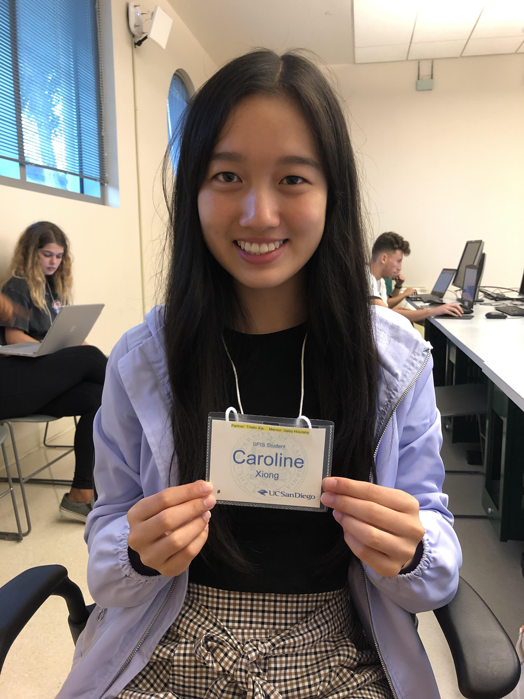

# practice-caroline-x
Hello, my name is Caroline Xiong. I am from New Jersey but I moved to San Ramon, California in the East Bay about 3 weeks ago. During SPIS, I hope to learn and become more proficient at coding in Python and also to make friends and also to form connections with mentors and faculty. I hope that I will be able to use Python to write programs that are applicable in real life and prepare myself for what is to come in the fall quarter. I like to run, play volleyball, listen to music. and talk with friends outside of academics. I also enjoy traveling, sightseeing, and exploring new places which makes San Diego a great place for me since I'm not familiar with the area!

